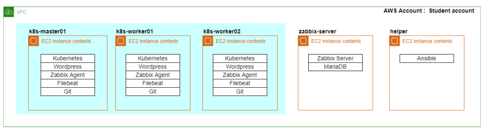
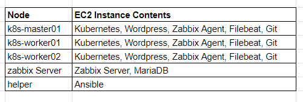
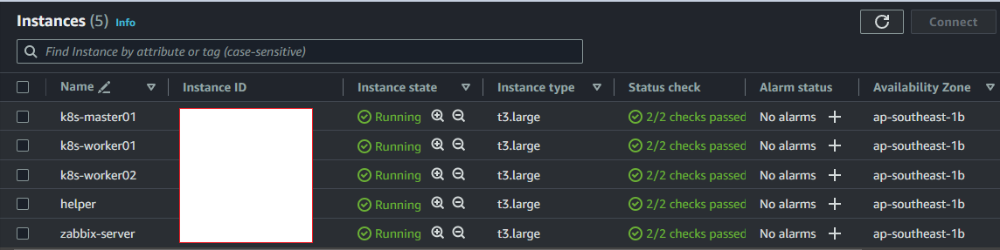

# Business requirements

# Introduction
This Project is designed to provide a comprehensive understanding and hands-on experience in setting up, deploying, and efficiently managing a robust infrastructure. From Day 0, where we establish the Kubernetes cluster, to Day 2 operations encompassing advanced monitoring and analytics,deep study into the intricacies of modern infrastructure management.

**Kubernetes Cluster Setup** (Session 01):
Lay the foundation by mastering the setup of a resilient and scalable Kubernetes cluster, essential for orchestrating containerized applications.

**Deploy Simple Application** (Session 02):
Dive into practical application deployment, gaining insights into the seamless integration of your applications within the Kubernetes environment.

**Monitoring Kubernetes** (Session 03):
Understand the importance of real-time monitoring in Kubernetes environments and explore tools to ensure optimal performance and reliability.

**Ansible Configuration** (Session 04):
Explore Ansible for configuration management, enabling efficient automation of routine tasks across your infrastructure.

**Zabbix Server and Agent Setup** (Sessions 05 and 06):
Establish a robust monitoring foundation with the deployment of Zabbix Server and Agents for comprehensive infrastructure monitoring.

**Grafana Configuration** (Session 07):
Dive into the world of visualization with Grafana, enhancing your ability to interpret and analyze key performance metrics.

**Filebeat and ELK Stack Setup** (Sessions 08 and 09):
Extend your monitoring capabilities by integrating Filebeat and the ELK Stack, ensuring comprehensive log analysis and visualization.

**Day 2 Operations** (Session 10):
Delve into advanced operational tasks, refining your skills in efficiently managing and optimizing the entire infrastructure.

**Advanced Grafana Configuration** (Session 11):
Elevate your visualization skills with advanced Grafana setups, enabling deeper insights into your infrastructure's health and performance.

Surprise! (Session 12):
Brace yourself for an exciting surprise session, designed to challenge and solidify the skills acquired throughout the project.

# Technologies & Tools
**Kubernetes**: Kubernetes was chosen as the primary container orchestration platform to automate deployment, scaling, and management of containerized applications. It forms the foundational layer for efficient infrastructure orchestration.

**Ansible**: Ansible serves as the automation tool for configuration management, streamlining tasks and processes across the infrastructure. Its role is crucial in ensuring efficient and automated workflows.

**Zabbix**: Zabbix, an enterprise-class open-source monitoring solution, is implemented to provide comprehensive monitoring capabilities for the infrastructure. It ensures real-time insights into system health and performance.

**Grafana**: Grafana, an open-source monitoring and observability platform, is employed for visualizing data from various sources. It enhances the understanding of infrastructure performance through interactive and customizable dashboards.

**Filebeat**: Filebeat, a lightweight log shipper, is utilized to forward and centralize log data. Its role is crucial in facilitating log data collection for enhanced monitoring and analysis.

#### **ELK Stack** (Elasticsearch, Logstash, Kibana):

**Elasticsearch**: Distributed search and analytics engine, employed for efficient data retrieval and analysis.
**Logstash**: Server-side data processing pipeline, ensuring the smooth flow of data for comprehensive log analysis.
**Kibana**: Analytics and visualization platform, providing rich insights into log data through interactive visualizations.

# Project Overview

The primary objective of the Comprehensive Infrastructure Orchestration and Monitoring Accelerator Project is to equip participants with the essential skills and hands-on experience needed to proficiently orchestrate, deploy, and monitor modern infrastructure. The project aims to achieve the following objectives:

**Kubernetes Mastery:**

Goal: Enable participants to set up and manage Kubernetes clusters effectively.
Outcome: Proficiency in deploying and scaling containerized applications using Kubernetes.
**Automation with Ansible:**

Goal: Develop skills in automating configuration management tasks.
Outcome: Efficient automation of routine infrastructure tasks using Ansible.
**Robust Infrastructure Monitoring:**

Goal: Implement comprehensive monitoring solutions with Zabbix and Grafana.
Outcome: Real-time insights into system health and performance, enhancing overall infrastructure monitoring capabilities.
**Log Analysis with ELK Stack:**

Goal: Integrate Filebeat and ELK Stack for in-depth log analysis.
Outcome: Enhanced log data collection and visualization, facilitating proactive issue resolution.
**Advanced Visualization using Grafana:**

Goal: Explore advanced Grafana setups for insightful data visualization.
Outcome: Proficiency in creating interactive and customizable dashboards to interpret infrastructure performance metrics.
**Day 2 Operations Mastery:**

Goal: Cover advanced operational tasks for optimizing and managing the infrastructure efficiently.
Outcome: Skills in handling complex operational scenarios and ensuring the optimal functioning of the entire infrastructure.
**Surprise Session:**

Goal: Challenge participants with a surprise session to solidify their acquired skills.
Outcome: Application of learned concepts in a real-world scenario, fostering adaptability and problem-solving skills.

# Before We Start

# Processes

[01 Setup Kubernetes Cluster](01_Setup_K8s_Cluster/README.MD)
[02 Deploy Simple Application](02_Deploy_Simple_Application/README.md)
[03 Setup Monitoring K8S](03_Setup_Monitoring_K8S/README.md)
[04 Setup Ansible](04_Setup_Ansible/README.md)
[05 Setup Zabbix Server](05_Setup_Zabbix_Server/README.md)
[06 Setup Zabbix Agent](06_Setup_Zabbix_Agent/README.md)
[07 Setup Grafana01](07_Setup_Grafana01/README.md)
[08 Setup Filebeat](08_Setup_Filebeat/README.md)
[09 Setup Kibana (ELK Stack)](09_Setup_Kibana_(ELK_Stack)/README.md)
[10 Day2 Operation](10_Day2_Operation/README.md)
[11 Setup Grafana02](11_Setup_Grafana02/README.md)
[12 Real word Situation](12_Real_Word_Situation/README.md)

# Summary

In conclusion, the Comprehensive Infrastructure Orchestration and Monitoring Project is a dynamic and immersive workshop that empowers participants with essential skills in modern infrastructure management. Through a well-structured curriculum spanning Kubernetes setup, application deployment, automation with Ansible, and advanced monitoring and visualization techniques, participants gain hands-on experience across crucial facets of IT operations. This intensive training equips individuals with the proficiency to orchestrate resilient Kubernetes clusters, efficiently deploy applications, and implement robust monitoring solutions. The surprise session further challenges participants, reinforcing their adaptability and problem-solving skills. As a comprehensive journey, this project ensures that participants emerge with a holistic understanding of infrastructure orchestration and monitoring, positioning them to navigate the complexities of real-world IT scenarios with confidence and competence.
