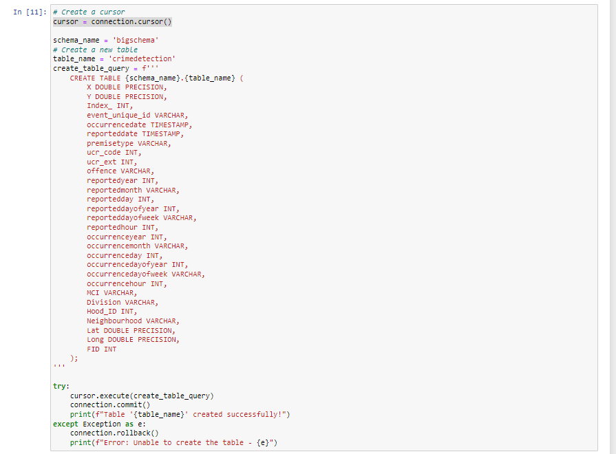

# Dataproc-Driven Data Processing: Hadoop-Spark, Amazon Redshift and Amazon QuickSight Integration 🐘

# Introduction
Embark on a transformative data processing journey with our project, "Dataproc-Driven Data Processing: Hadoop, Spark, Redshift, and QuickSight Integration." This endeavor harnesses the power of Google Cloud Dataproc to orchestrate a seamless Hadoop-Spark pipeline, enabling efficient data manipulation and analytics on Google Cloud Storage. Integrated with Jupyter Notebook and powered by PySpark, our solution ensures a user-friendly data exploration experience. The final destination for our processed data is AWS Redshift, a fully managed data warehouse, promising scalability and accessibility for comprehensive business intelligence and analytics. Furthermore, AWS QuickSight is seamlessly integrated for advanced data visualization, adding an extra layer of insight to your analytics. Join us in navigating the convergence of Dataproc, Hadoop, Spark, Redshift, and QuickSight, creating a unified and insightful data processing experience.

# Data Description
The dataset, spanning from 2014 to 2017, encapsulates information on crime incidents with a focus on major offenses. Each record details the geographic coordinates (X, Y) of the event location, a unique event identifier (event_unique_id), occurrence and reported dates, premise type (premisetype), Uniform Crime Reporting (UCR) codes, offense type, and various temporal components such as reported and occurrence years, months, days, and hours. Additional attributes include the Major Crime Indicator (MCI) category, police division (Division), neighborhood ID (Hood_ID), neighborhood name, and geographical coordinates (Lat, Long). This dataset serves as a valuable resource for analyzing crime patterns, trends, and their spatial-temporal dynamics over the specified period.

# Technologies & Tools
Big Data Processing: Apache Hadoop, Apache Spark <br>
Cloud Platform: GCP, AWS <br> 
Data Exploration: Jupyter Notebooks with Python <br>
Data Storage: Google Cloud Storage (GCS), AWS Redshift <br>
Data Visualization: AWS QuickSight <br>
Programming Languages: Python (PySpark and Pandas) <br>

# Data Flow & Diagram

# Project Overview
This project, titled "Dataproc-Driven Data Processing: Hadoop, Spark, Redshift, and QuickSight Integration," aims to create a streamlined and integrated data processing pipeline. Leveraging Google Cloud Dataproc, Apache Hadoop, Apache Spark, AWS Redshift, and AWS QuickSight, the objective is to orchestrate a seamless Hadoop-Spark workflow for efficient data manipulation and analytics on Google Cloud Storage. The solution, integrated with Jupyter Notebook and powered by PySpark, ensures a user-friendly data exploration experience. The final outcome involves storing processed data in AWS Redshift, a fully managed data warehouse, and utilizing AWS QuickSight for advanced data visualization and business intelligence. This project seeks to deliver a unified and insightful data processing experience, enabling users to efficiently explore, manipulate, and analyze large datasets for informed decision-making.

# Before Start
- Ensure that you have a Hadoop cluster installed with Jupyter Notebook. (I created one using Dataproc with 1 master and 2 worker nodes)
   


# Process
1. SSH to connect to the VM of the master node, then run the command:
   ```jupyter notebook```
   

and wait for the server to start.

Afterward, connect to it through the web interface tab.


2. Create an .ipynb file for SparkProcessing and start by running a SparkSession. Load data from GCS storage using the gs:// path.


3. Implement various data processing techniques such as handling missing values, conducting Exploratory Data Analysis (EDA), or even developing machine learning models after completing the data processing. Assume that the data processing is finished.


4. Export the processed data into a CSV file with headers.
   


5. Create an .ipynb file for RedshiftWithSpark and load all parts of the CSV file (as Spark exports data in multiple files across workers).
   
   


6. Connect to Amazon Redshift (depending on the type of Redshift, but in this case, I use the serverless option).
   


7. Create a table in Redshift following the data types of our DataFrame.
   



8. Insert our data into the table on Redshift.

 

 then the data will appear on Amazon Redshift
 
  

9. Connect the data to Amazon QuickSight, then choose our database host. 


10. Create a dashboard in QuickSight.


# Summary

This project, titled "Dataproc-Driven Data Processing: Hadoop, Spark, Redshift, and QuickSight Integration," is a comprehensive exploration into building an end-to-end data processing pipeline. The journey begins with the setup of a Hadoop cluster integrated with Jupyter Notebook, utilizing Google Cloud Dataproc. The subsequent steps involve Spark data processing, starting with the creation of an .ipynb file for SparkProcessing. This file facilitates loading data from Google Cloud Storage (GCS) using the gs:// path and implementing various data processing techniques, such as handling missing values and conducting exploratory data analysis (EDA). The processed data is then exported into a CSV file with headers.

Moving forward, the project extends into the realm of AWS, focusing on Redshift integration. An additional .ipynb file, RedshiftWithSpark, is created to load multiple parts of the CSV file into Amazon Redshift. The integration includes connecting to Redshift, creating a table based on the DataFrame's data types, and inserting the processed data into the Redshift table.

The project concludes by bridging the gap between data and insights. The processed data in Redshift is connected to Amazon QuickSight, enabling the creation of insightful dashboards for advanced data visualization and business intelligence. This holistic approach ensures that the project delivers a unified and insightful data processing experience, empowering users to explore, manipulate, and derive meaningful insights from large datasets.

